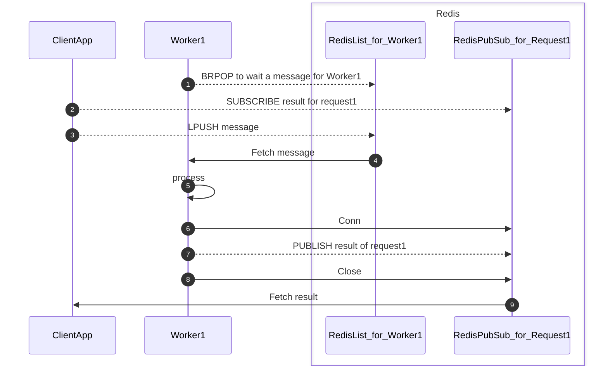

# bamboo

bamboo is a library for distributing work across machines with asynchronous communication.

## Overview

* Workers are applications that execute time-consuming processes.
* ClientApp combines worker processing.
* ClientApp and Workers communicate asynchronously using Redis, for example.

## Components

### Worker

1. Worker consumes a request.
2. Worker creates a Worker Job from the request.
3. Worker dispatches the Worker Job to the goroutine worker.
4. Worker Job gets the result.
5. Worker Job Publishes the result.

### Worker Client

1. Worker Client starts to subscribes to a result first.
2. Worker Client produces a request.
3. Worker Client receives the result after Worker Job publishes the result.

### Request Producer / Consumer

|Middleware|Component|
|---|---|
|Redis|Redis List can be used as a Request Producer / Consumer.|
|Kafka|Kafka can be used as a Request Producer / Consumer.|

#### Result Publisher / Subscriber

|Middleware|Component|
|---|---|
|Redis|Redis Pub/Sub can be used as a Result Publisher / Subscriber.|

## Installation

## Example

## Development

* https://vektra.github.io/mockery/latest/installation/

