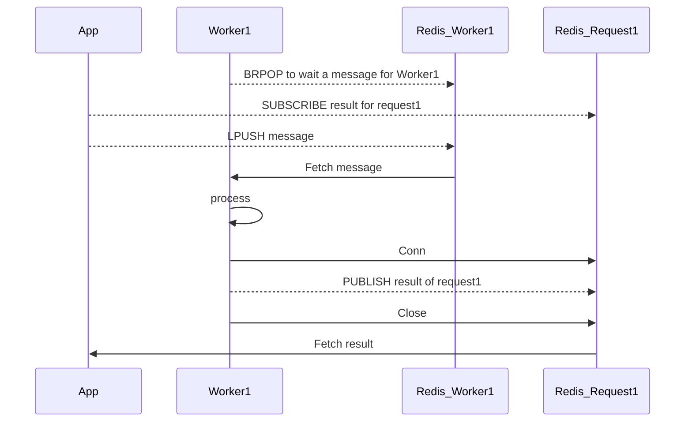

# bamboo

bamboo is a library for distributing work across machines with asynchronous communication.

## Overview

* Workers are applications that execute time-consuming processes.
* App combines worker processing.
* App and Workers communicate asynchronously using Redis, for example.

## Installation

## Example

## Development

* https://vektra.github.io/mockery/latest/installation/

