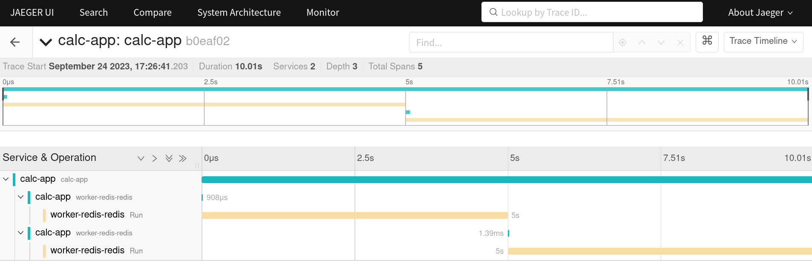

# bamboo example

## Prerequisite

* docker compose
* protoc
* golang

## How to run

```bash
make docker-up
```

```bash
make run-worker-redis-redis
```

```bash
make run-calc-app
```

## Result
Open [JAEGER](http://localhost:16686/search)

